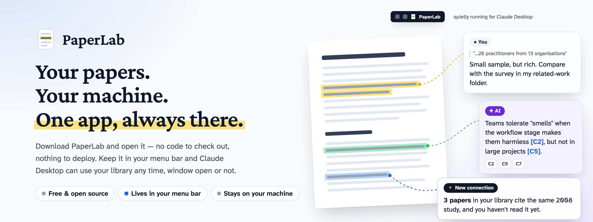
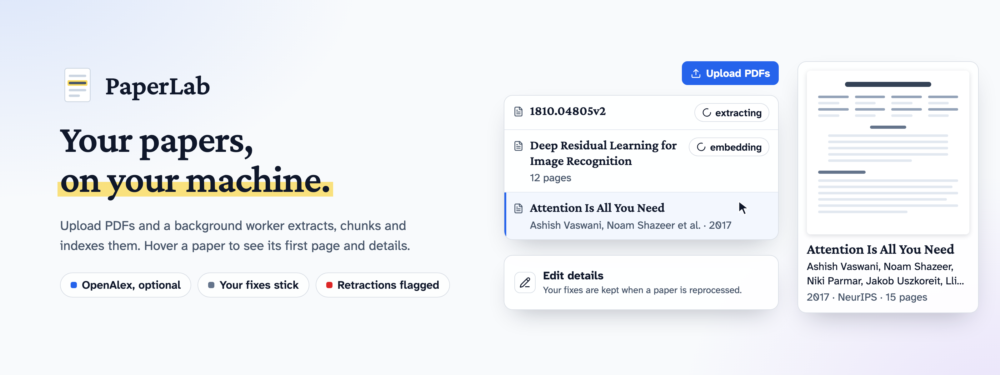
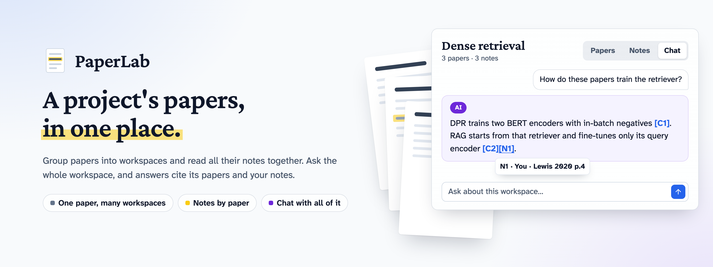
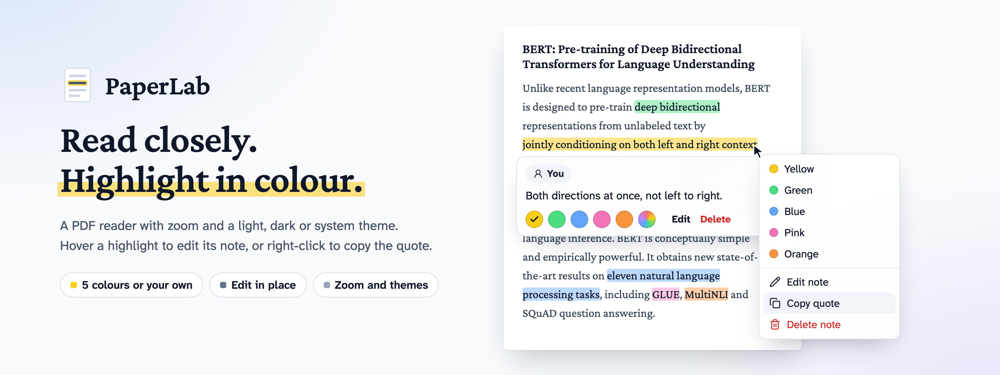
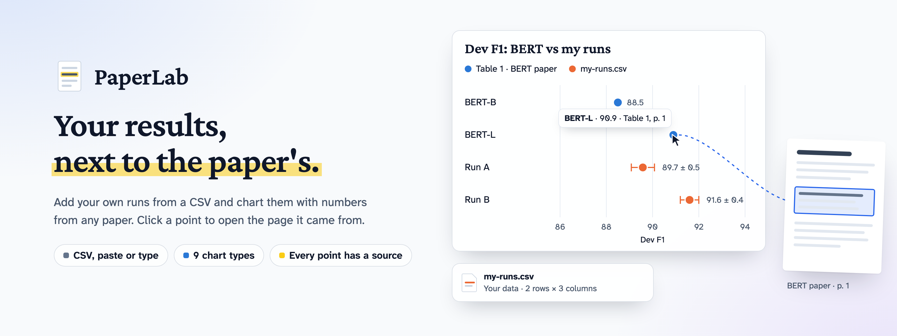
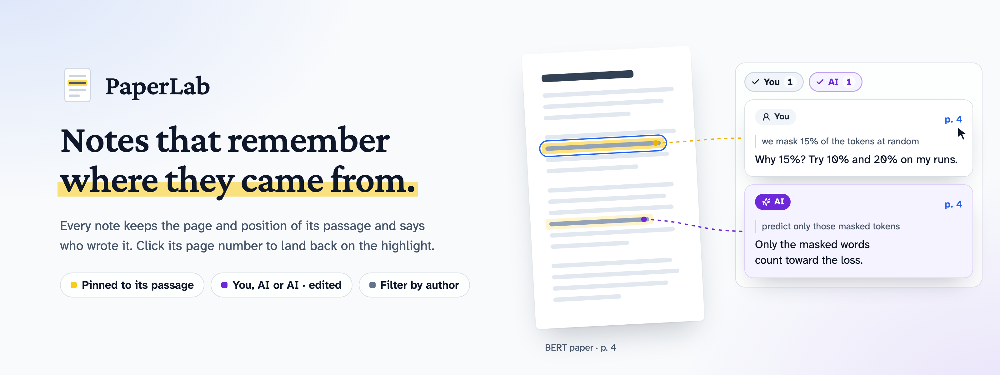
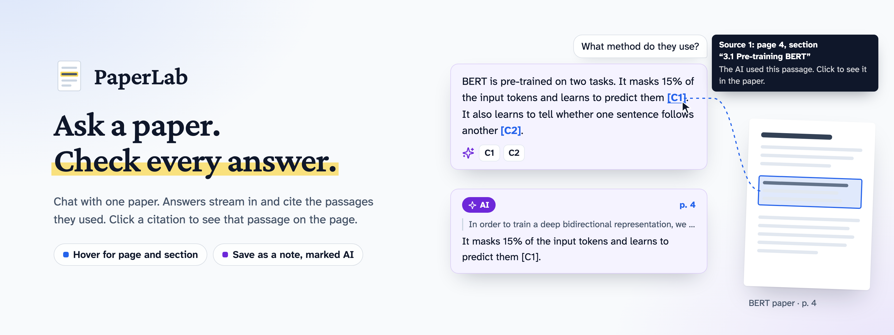
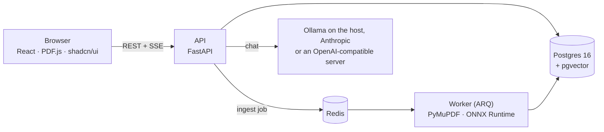

<picture>
  <source media="(prefers-color-scheme: dark)" srcset=".github/assets/paperlab-banner-dark.png">
  
</picture>

# PaperLab

PaperLab is a research reading tool that runs on your own machine. You drop in PDFs, read them, highlight passages,
and write notes that stay attached to the exact spot they came from. You can ask a paper questions and get answers
that cite the passages they used, then keep the useful parts as notes.

The note is the main thing in PaperLab, not the chat. Anything an AI wrote is stored apart from what you wrote and is
always marked as AI in the interface.

## What you can do

**Build a library**

<picture>
  <source media="(prefers-color-scheme: dark)" srcset=".github/assets/feature-library-dark.png">
  
</picture>

- Upload PDFs. A background worker extracts the text, splits it into sections and chunks, and indexes it for search.
- Find papers by title, DOI or arXiv ID with **Find papers**. It asks every paper source you turn on in
**Settings → Paper sources** at once (arXiv, Crossref, CORE, Unpaywall and Semantic Scholar are free; OpenAlex can
cost money and stays off until you tick it), shows one list with the sources that found each paper, and adds one in a
click when a free PDF exists (arXiv, a repository or an open-access publisher). A paper with no free copy links to its
page, so you can download it yourself. Nothing gets past a paywall.
- Open a paper's **Similar** tab for papers like it, suggested by [Semantic Scholar](https://www.semanticscholar.org/),
and add them the same way.
- Open a paper's **References** tab to see what it cites and what has cited it since, ranked for your library:
references several of your papers cite come first, then ones close to what you write notes about, then ones with a
free PDF. Import a reference in a click when a free PDF exists.
- Open the **Graph** page to see how your papers connect: what cites what, papers in the same workspace, a note
anchored on two of them, a shared author or topic, and papers that simply read alike — each a layer you can switch on
or off. Similar content comes from the same embeddings search uses. Click a paper to focus it and list its
connections, and draw your own link between two papers with a label like "builds on". Look at it five ways: the 2D
map, a 3D one you can turn around when clusters overlap, a **Matrix** of exactly which papers connect and how (a table
a screen reader can read cell by cell), a **Timeline** of what builds on older work, by year published or date added,
and **Rings** showing how many links away everything is from one paper.
- Hover a paper in the list to preview its first page and details.
- With OpenAlex ticked in Settings, fill in each paper's title, authors, year, venue and topics from
[OpenAlex](https://openalex.org/), and correct any of them by hand with **Edit details**. Your corrections are kept when
a paper is processed again.
- A retracted paper shows a banner at the top of the reader that can't be dismissed.
- Manage models in **Settings**: add connections and keys, test them, choose which models chat lists and the
default, pull and delete Ollama models with live progress. Keys stay in your local database and are never sent
back to the browser.

**Group papers into workspaces**

<picture>
  <source media="(prefers-color-scheme: dark)" srcset=".github/assets/feature-workspaces-dark.png">
  
</picture>

- Group papers into workspaces (a paper can be in several), see all their notes in one place, and chat with a whole
workspace: answers cite passages from its papers and your notes.

**Read and highlight**

<picture>
  <source media="(prefers-color-scheme: dark)" srcset=".github/assets/feature-reading-dark.png">
  
</picture>

- Read in a PDF.js reader with zoom, in a light, dark or system theme. The page itself stays white.
- Select text to highlight it in one of five colours, or a custom one, and add a note if you want.
- Hover a highlight to see, edit, recolour or delete its note in place. Right-click it for the same actions and "Copy quote".
- Hover a numbered citation the PDF links, like `[51]`, to see which paper it is: its details once the paper's
references are looked up, with **Open in PaperLab** when it's in your library or **Add to library** when a free PDF
exists, and otherwise the entry exactly as the reference list prints it. Click it to jump to that entry, and **Back to
page N** takes you back to where you were. Tab reaches every citation too.
- Resize the side panel by dragging its edge. It remembers the width.

**Capture data and chart it**

<picture>
  <source media="(prefers-color-scheme: dark)" srcset=".github/assets/feature-chart-your-data-dark.png">
  
</picture>

- Capture a table by drawing a box over it, or select a number like `88.5 ± 0.3` to keep it, add your own data from a
CSV, and chart them side by side. Click any point on a chart to open its page in the paper.

**Keep notes that stay findable**

<picture>
  <source media="(prefers-color-scheme: dark)" srcset=".github/assets/feature-notes-dark.png">
  
</picture>

- Every note keeps the page and position of its passage. Click a note to jump back to it in the paper.
- Each note shows who wrote it: **You**, **AI**, or **AI · edited**.
- Filter the notes list to show only your notes, only AI notes, or both.

**Ask a paper questions**

<picture>
  <source media="(prefers-color-scheme: dark)" srcset=".github/assets/feature-ask-a-paper-dark.png">
  
</picture>

- Chat with one paper at a time. Answers stream in as they are written.
- Pick the model for each question from the chat panel: a local Ollama model, Anthropic with your own key, or any
OpenAI-compatible server (OpenAI, OpenRouter, Groq, Mistral, DeepSeek, Gemini, LM Studio, vLLM, llama.cpp). Cloud
models are tagged "Cloud". Each answer keeps the model and connection that wrote it.
- Answers cite the passages they use, like `[C1]`. Hover a citation to see its page and section, and click it to
scroll the paper to that passage and flash it.
- A short paper is sent to the model whole. A long one is searched first, and only the most relevant passages are sent.
- Your notes on the paper go to the model with its passages, marked You or AI, and answers can cite them like `[N1]`.
Click one to jump to that note.
- Press **Follow up** under an answer to ask about it. The model gets your earlier questions and the passages they
used, never its own earlier answers. Follow-ups stay under the first question, and your next questions keep following
the newest answer until you press ×.
- Select part of an answer and click **Save as note**. The note is anchored on the passage it cites and marked AI.

**Use your library from Claude Desktop**

- Connect Claude Desktop, Claude Code or another MCP client to PaperLab
([how](#use-paperlab-from-claude-desktop)). It can search your papers, read a paper's details, outline and notes, find
the papers in your library connected to one (a shared workspace, note, author or topic, or a citation), and save a note
on a passage it quotes.
- A note it saves is marked AI, like a note saved from chat, and is highlighted on the lines it quoted.


## Principles

- **Local first.** One user, one machine, no accounts. Your PDFs, notes and search index live in a local Postgres
database. With a local model (Ollama, LM Studio and other servers on your machine), the text of your papers and
notes never leaves your computer; a model tagged "Cloud" receives the passages and notes sent with each question.
Metadata lookups on OpenAlex are off unless you tick OpenAlex, and they send a paper's DOI or title, never its text.
Find papers sends what you type to every paper source that is on and can answer it, then the results' DOIs to Semantic
Scholar and, for results without a free PDF, to Unpaywall. The Similar and References tabs send Semantic Scholar the
paper's DOI (its arXiv ID when the DOI is an arXiv one), or its title when it has none. With OpenAlex ticked, the
References tab also sends OpenAlex the paper's OpenAlex ID and the OpenAlex IDs of the works it cites. Your contact
email goes to Crossref, Unpaywall and OpenAlex (when on), never to the others or to PDF hosts.
API keys stay in your local database and are never sent back to the browser. Adding a paper downloads its PDF from the
free link found. None of them send a paper's text.
An MCP client you connect, such as Claude Desktop, receives what its tools return: passages from your papers, paper
details and workspace names, and every note on a paper marked as yours or AI. Claude Desktop and Claude Code send what
the tools return to Anthropic.
- **Updates are announced, never installed.** Each time it opens, the desktop app asks GitHub whether a newer version
is out and offers a download link when there is one. It is the only request the app makes on its own; turn it off in
**Settings → Desktop app**.
- **An upgrade keeps a way back.** Before a new version first starts, the desktop app saves a copy of your library's
database in its data folder, keeping only the latest.
- **AI is always labelled.** AI text is stored separately from yours, keeps the model and prompt version that
produced it, and shows an AI badge. Editing an AI note marks it "AI · edited", never "You".
- **Answers show their sources.** Chat answers cite passages you can click, so you can check every claim against the paper.


## Quick start

### The desktop app

PaperLab runs on [Docker](https://www.docker.com/products/docker-desktop/): install Docker Desktop and open it once.
Then download PaperLab for your system from the
[latest release](https://github.com/khannoussi-malek/PaperLab/releases/latest) and open it.

| System | File |
|---|---|
| macOS with Apple silicon | `PaperLab-<version>-arm64.dmg` |
| macOS with an Intel processor | `PaperLab-<version>-x64.dmg` |
| Windows | `PaperLab-<version>-x64.exe` |
| Linux | `PaperLab-<version>-x86_64.AppImage`, or `PaperLab-<version>-amd64.deb` |

The first launch downloads PaperLab itself (about 335 MB; an update downloads only what changed) and opens it in its
own window. A short setup then offers a chat model and a search model. Each downloads only if you pick it, and Skip
leaves both for later in Settings: reading, highlighting and notes need neither.

PaperLab isn't signed yet, so your system asks before the first launch, and again after each update:
- **macOS:** open PaperLab and close the warning. Then open **System Settings → Privacy & Security**, find the line
  about PaperLab near the bottom, and click **Open Anyway**.
- **Windows:** on "Windows protected your PC", click **More info**, then **Run anyway**.
- **Linux:** make the AppImage executable (`chmod +x PaperLab-*.AppImage`) and run it. If it doesn't start (Ubuntu
  24.04 blocks some AppImages, and Ubuntu 22.04 and later lack `libfuse2`), install the `.deb` instead.

Closing the window stops PaperLab and frees its memory. To keep it running for Claude Desktop, turn on **Keep PaperLab
running when the window is closed** in **Settings → Desktop app**: its menu-bar icon then opens or quits PaperLab.

Any Docker that provides the `docker` command works: Docker Desktop, OrbStack, Colima or Rancher Desktop. Docker
Desktop is free for personal use, education and small companies; larger companies need a paid Docker subscription.

On Linux:
- install Docker from [docker.com](https://docs.docker.com/engine/install/), not the Snap package: the Snap's Docker
  can't read `~/.config`, where PaperLab keeps its files;
- let Ollama listen beyond 127.0.0.1, so PaperLab's containers can reach it: run `sudo systemctl edit ollama`, add
  `Environment="OLLAMA_HOST=0.0.0.0"` under `[Service]`, then `sudo systemctl restart ollama`. Other machines on your
  network can then reach Ollama too, unless a firewall stops them.

### Without the app

With Docker Compose 2.24 or later, two commands install the same release, with no clone and no build:

```sh
VERSION=0.1.0   # the latest release's number
curl -L "https://github.com/khannoussi-malek/PaperLab/releases/download/v$VERSION/paperlab-$VERSION.tar.gz" | tar xz
cd paperlab && docker compose up -d   # then open http://127.0.0.1:5190
```

The `paperlab` folder holds `docker-compose.yml` and `scripts/paperlab-mcp`. To update, unpack a newer release over it
and run `docker compose up -d` again. Nothing starts with the computer: `docker compose stop` stops PaperLab and
`docker compose up -d` starts it.

### Your library

The desktop app and the commands above share one library, in the `paperlab-app` project's Docker volumes, so use one
or the other. Updating or uninstalling keeps it.

Before a new version of the app first starts, the app saves a copy of the database as `backups/latest.sql.gz` in its
data folder, replacing the previous copy. The data folder is:
- macOS: `~/Library/Application Support/PaperLab`;
- Windows: `%APPDATA%\PaperLab`;
- Linux: `~/.config/PaperLab`.

Without the app, back up by hand in the PaperLab folder:
`docker compose exec -T db pg_dump -U paperlab paperlab | gzip > paperlab-backup.sql.gz`.

Going back to an older version on a library a newer one has used isn't supported: it doesn't start, and says why.

`docker compose -p paperlab-app down -v` deletes everything: the library, its PDFs and the search model. The app's
backup stays in its data folder.

### Build from source

For contributors, with Docker and [Ollama](https://ollama.com/) installed:

```sh
ollama pull qwen3:8b                  # the default chat model
docker compose up -d --build          # db (:5433), redis, api (:8000), worker, frontend (:5180)
open http://localhost:5180
```

### First start

PaperLab works without a search model: upload papers, read them, highlight and take notes, and chat with short ones.
Chatting with a long paper or a workspace needs the built-in search model, and so does Claude's `search_library`: it
is `nomic-embed-text-v1.5` running on ONNX Runtime (548 MB). Download it in **Settings → Search**, or from the library
or chat when a long paper needs it. It goes into the `models` volume, and the papers you added before are made
searchable in the background. If Settings → Search then says some chunks were indexed with another model, re-index
the library there once. The graph's Similar content layer and the References tab's note ranking also stay off until
the model is downloaded.

Upgrading from an older PaperLab? It ran the model on torch and kept it in the `hfcache` volume, which nothing uses
any more: `docker volume rm paperlab_hfcache` frees its space (about 0.5 GB).

Real chats also need a model: `ollama pull qwen3:8b` on the host. While there are no model connections, the API
creates one at startup from `LLM_PROVIDER` / `LLM_MODEL` in `.env`; after that, add and switch models in **Settings**.

Choose where Find papers looks in **Settings → Paper sources**: tick sources, add optional API keys and a contact
email (Unpaywall needs one). OpenAlex, which also fills in paper details, is off until you tick it: it is free up to
$0.10 of use a day without a key, or $1 a day with a free key from openalex.org, and more needs a paid plan there. On
first start, `OPENALEX_MAILTO` and `SEMANTIC_SCHOLAR_API_KEY` from `.env` fill these settings in once.

### Use PaperLab from Claude Desktop

PaperLab includes an MCP server. Claude Desktop, Claude Code or another MCP client starts it inside the running `api`
container, where it can read your PDFs, so PaperLab must be running: the desktop app open (or **Keep running** on in
Settings → Desktop app), or `docker compose up -d` in the PaperLab folder.
Restarting `api` ends the connection, and Claude Desktop needs a restart to connect again. If the server doesn't
start, Claude Desktop writes what the launcher says to its own log: macOS `~/Library/Logs/Claude/mcp-server-paperlab.log`,
Windows `%APPDATA%\Claude\logs\mcp-server-paperlab.log`, Linux in Claude Desktop's logs folder.

Open PaperLab and click **Connect Claude**. It fills in the config or command for your system, and checks that
PaperLab's side answers.

Without the Connect Claude page, use the full path of your PaperLab folder (the desktop app's data folder above, or
the folder you unpacked):
- **macOS and Linux:** in Claude Desktop (**Settings → Developer → Edit Config**), give `mcpServers.paperlab` the
  `"command": "<folder>/scripts/paperlab-mcp"`. For Claude Code: `claude mcp add -s user paperlab -- '<folder>/scripts/paperlab-mcp'`.
  Don't use `mcp install`: the entry it writes runs the server outside the container.
  The script finds docker even where Claude Desktop can't see your shell's `PATH`; if yours is installed somewhere
  else, set `PAPERLAB_DOCKER` to its full path.
- **Windows:** give `mcpServers.paperlab` the `"command": "docker"` and the
  `"args": ["compose", "-f", "<folder>\\docker-compose.yml", "exec", "-T", "api", "python", "-m", "mcp_server"]`.

The server has four tools:
- `search_library`: passages closest to a question, in the whole library or one workspace;
- `get_paper`: a paper's details, section outline, workspaces and every note with who wrote it;
- `related_papers`: library papers connected to one, up to three links away;
- `create_note`: a note on a passage it quotes exactly.

The first search takes a few seconds while the search model loads. Without it, `search_library` answers that search isn't set up.

### Configuration

Settings live in an optional `.env` beside `docker-compose.yml`: every one has a default.


| Variable                                                    | Default                             | What it does                                                                                                                        |
| ----------------------------------------------------------- | ----------------------------------- | ----------------------------------------------------------------------------------------------------------------------------------- |
| `LLM_PROVIDER`                                              | `ollama`                            | Seeds the first model connection: `ollama` or `anthropic`. `fake` answers every model with fixed text (for tests) and seeds nothing |
| `LLM_MODEL`                                                 | `qwen3:8b`                          | The first connection's default model                                                                                                |
| `OLLAMA_URL`                                                | `http://host.docker.internal:11434` | Seeds the first Ollama connection's address (the host, not Compose); change it in Settings afterwards                               |
| `ANTHROPIC_API_KEY`                                         | none                                | Seeds an Anthropic connection when `LLM_PROVIDER=anthropic`; add keys in Settings afterwards                                        |
| `ANTHROPIC_MAX_TOKENS`                                      | `64000`                             | The longest answer an Anthropic model may write                                                                                     |
| `OPENALEX_MAILTO`                                           | empty (off)                         | Seeds Settings → Paper sources once, on first start: your contact email, with OpenAlex ticked. Change it in Settings afterwards     |
| `SEMANTIC_SCHOLAR_API_KEY`                                  | empty                               | Seeds the Semantic Scholar key in Settings → Paper sources once, on first start. Change it in Settings afterwards                   |
| `DISCOVERY_PROVIDER`                                        | `live`                              | `fake` answers Find papers and Similar with three fixed papers and no network (for tests)                                           |
| `POSTGRES_PASSWORD`, `DATABASE_URL`, `REDIS_URL`, `PDF_DIR` | see `.env.example`                  | Database, queue and PDF storage                                                                                                     |


## How it works




- **Ingestion:** an upload queues one job that can safely run again. The paper's status moves through
`uploaded → extracting → chunking → embedding → enriching → ready`, or `failed` with the reason. Enrichment never fails
a paper: with no OpenAlex match, or no network, it is still ready. PyMuPDF extracts the text with
its coordinates, so highlights and citations can point at exact rectangles on the page. Chunks are embedded with
`nomic-embed-text-v1.5` on ONNX Runtime into `vector(768)` columns once the search model is downloaded; until then a
paper is ready without them.
- **Chat:** a question retrieves the closest chunks for that paper (or sends the whole paper if it's short), streams the
model's answer over Server-Sent Events as `sources → token → done`, and saves it with its prompt version. Prompts are
versioned files in `backend/prompts/`.
- **Code layout:** domain logic lives in `backend/app/core` with no web framework imports. The frontend's API types are generated from the backend's OpenAPI schema.

```text
backend/
  app/api/         HTTP routes: papers, notes, chat, health, llm, embedding
  app/core/        domain logic: chunking, retrieval, chat, note provenance rules
  app/providers/   PDF extraction, the search model and its download, OpenAlex, LLM adapters (Ollama, Anthropic, OpenAI-compatible, fake), Ollama pull/delete
  app/workers/     the ARQ jobs: ingestion and the references fetch
  mcp_server/      the MCP server Claude Desktop starts: search, papers, related papers, notes
  prompts/         versioned prompts
  evals/           retrieval eval: recall@k over questions.yaml
frontend/
  src/features/    library, reader, notes, chat, settings
  design-system/   MASTER.md: design tokens and UI rules
  e2e/             Playwright specs against the real stack
```


## Development

```sh
curl localhost:8000/api/health        # vector round-trip through ORM and raw SQL
curl -X POST localhost:8000/api/papers/<id>/reingest     # idempotent re-run after changing chunking

cd backend && uv run pytest && uv run ruff check .       # needs the compose db
cd frontend && npm run gen:api                           # regenerate API types (api running)
cd frontend && npx tsc -b && npm test                    # types + unit tests
cd frontend && npx playwright install chromium            # once
cd frontend && npm run typecheck:e2e && npm run e2e      # end-to-end against the running stack
cd desktop && npm ci && npm test && npm run typecheck    # the desktop app: unit tests and types
cd desktop && npm run e2e -- --project=stub              # its window against a stub docker
docker compose exec api python -m evals.answer_check --paper "<title prefix>" --workspace "<name>"  # manual, real LLM
```

- **End-to-end tests** run against the real stack, with no mocked backend. They expect the fake model, which always
gives the same answer, and the search model downloaded: start the API and the worker with
`LLM_PROVIDER=fake DISCOVERY_PROVIDER=fake docker compose up -d api worker`, run the tests, then go back with
`docker compose up -d api worker`. The specs tagged `@no-search-model` need a stack with no search model and skip
themselves otherwise: start it with
`MODELS_DIR=/models/none LLM_PROVIDER=fake DISCOVERY_PROVIDER=fake docker compose up -d api worker`, then run
`npx playwright test --project=no-search-model --no-deps`, then `docker compose up -d api worker` again to bring the
models folder back.
- **The release stack** is what the desktop app and the two-command install run. Build it with
`docker build -t ghcr.io/khannoussi-malek/paperlab:dev -t ghcr.io/khannoussi-malek/paperlab:<desktop/package.json's version> .`,
then start it with `LLM_PROVIDER=fake DISCOVERY_PROVIDER=fake docker compose -f desktop/docker-compose.yml up -d`. It
serves the built app on :5190 with its own volumes. In `frontend/`,
`E2E_RELEASE=1 E2E_BASE_URL=http://127.0.0.1:5190 npx playwright test --project=release` runs what a fresh install must
pass. In `desktop/`, `E2E_RELEASE=1 npx playwright test --project=release-stack` drives the app over it: upgrade backup,
close and quit. `docker compose -f desktop/docker-compose.yml down -v` deletes that library, which is also the desktop
app's.
- **Retrieval eval:** `docker compose exec api python -m evals.run` prints recall@k for the questions in
`backend/evals/questions.yaml`, asking with the search model PaperLab ships; `--variant full` or `--variant int8` asks
with the other one once it is downloaded. Run it twice after a re-ingest before comparing results.
- **Parity with the original model:** `backend/tests/test_embedding_parity.py` compares the full-precision ONNX model
with vectors recorded from the torch model it replaced. It runs when `MODELS_DIR` points at a folder that holds it
(`docker compose cp api:/models/nomic-embed-text-v1.5 <folder>/`) and is skipped otherwise.
- **Answer eval:** `docker compose exec api python -m evals.answers --label <name>` asks the default model the
questions in `backend/evals/answers.yaml` (facts, summaries, follow-ups, notes, questions a paper can't answer) and
scores each answer. `--summarize` compares saved runs in `backend/evals/results/`. It takes a while on a local model:
don't restart the API while it runs.
- **UI changes** follow `frontend/design-system/MASTER.md`: shadcn/ui components, Tailwind tokens, both themes, and the  
stable test hooks listed there.


## Contributing

PaperLab is [Apache-2.0](LICENSE) and open to contributions.

The most useful ten minutes you can spend needs no application code: add a question from your field to
`backend/evals/questions.yaml`. The retrieval eval currently covers two machine-learning papers, so it says nothing
about how PaperLab behaves on a clinical trial, a legal corpus, or an economics paper with three tables and no
abstract. One entry changes that, and every later change to chunking or retrieval gets checked against your field.

[CONTRIBUTING.md](CONTRIBUTING.md) has the rest: how to run the stack, which tests to run, and the four rules a pull
request can't break. Issues labelled
[`good first issue`](https://github.com/khannoussi-malek/PaperLab/labels/good%20first%20issue) and
[`paper-source`](https://github.com/khannoussi-malek/PaperLab/labels/paper-source) are where to start.
