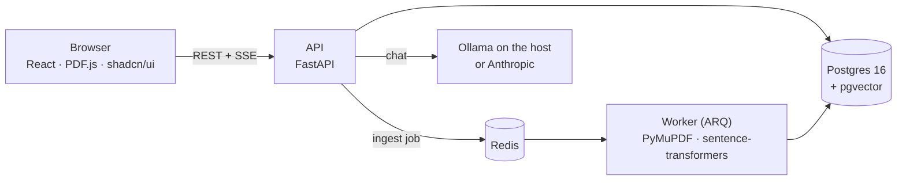

# PaperLab

PaperLab is a research reading tool that runs on your own machine. You drop in PDFs, read them, highlight passages,
and write notes that stay attached to the exact spot they came from. You can ask a paper questions and get answers
that cite the passages they used, then keep the useful parts as notes.

The note is the main thing in PaperLab, not the chat. Anything an AI wrote is stored apart from what you wrote and is
always marked as AI in the interface.

## What you can do

**Build a library**

- Upload PDFs. A background worker extracts the text, splits it into sections and chunks, and indexes it for search.
- Hover a paper in the list to preview its first page and details.
- Group papers into workspaces (a paper can be in several), see all their notes in one place, and chat with a whole
workspace: answers cite passages from each paper and your notes.
- Optionally fill in each paper's title, authors, year, venue and topics from [OpenAlex](https://openalex.org/), and
correct any of them by hand with **Edit details**. Your corrections are kept when a paper is processed again.
- A retracted paper shows a banner at the top of the reader that can't be dismissed.

**Read and highlight**

- Read in a PDF.js reader with zoom, in a light, dark or system theme. The page itself stays white.
- Select text to highlight it in one of five colours, or a custom one, and add a note if you want.
- Hover a highlight to see, edit, recolour or delete its note in place. Right-click it for the same actions and "Copy quote".
- Resize the side panel by dragging its edge. It remembers the width.

**Keep notes that stay findable**

- Every note keeps the page and position of its passage. Click a note to jump back to it in the paper.
- Each note shows who wrote it: **You**, **AI**, or **AI · edited**.
- Filter the notes list to show only your notes, only AI notes, or both.

**Ask a paper questions**

- Chat with one paper at a time. Answers stream in as they are written.
- Answers cite the passages they use, like `[C1]`. Hover a citation to see its page and section, and click it to
scroll the paper to that passage and flash it.
- A short paper is sent to the model whole. A long one is searched first, and only the most relevant passages are sent.
- Select part of an answer and click **Save as note**. The note is anchored on the passage it cites and marked AI.


## Principles

- **Local first.** One user, one machine, no accounts. Your PDFs, notes and search index live in a local Postgres
database. With the default Ollama model, the text of your papers never leaves your computer. Metadata lookups on
OpenAlex are off unless you turn them on, and they send a paper's DOI or title, never its text.
- **AI is always labelled.** AI text is stored separately from yours, keeps the model and prompt version that
produced it, and shows an AI badge. Editing an AI note marks it "AI · edited", never "You".
- **Answers show their sources.** Chat answers cite passages you can click, so you can check every claim against the paper.


## Quick start

You need [Docker](https://www.docker.com/) and [Ollama](https://ollama.com/) running on your machine.

```sh
ollama pull qwen3:8b                  # the default chat model
cp .env.example .env
docker compose up -d --build          # db (:5433), redis, api (:8000), worker, frontend (:5180)
open http://localhost:5180
```

The first upload takes longer: the worker downloads the embedding model once and caches it.

### First start

The worker loads the embedding model (`nomic-ai/nomic-embed-text-v1.5`, about 523 MB) when it starts, and the API
loads it on the first question that retrieves: every workspace chat, and large papers. Both read the `hfcache`
volume. Download the model into it once, before the first `docker compose up`:

```sh
docker compose build api
docker compose run --rm --no-deps api python -c "from app.providers.embedding import load; load()"
```

Hugging Face gives up on a download after 10 seconds without data. On a slow connection, raise that in `.env`
(both containers read it):

```sh
HF_HUB_DOWNLOAD_TIMEOUT=60
```

Real chats also need the model: `ollama pull qwen3:8b` on the host, or set `LLM_PROVIDER` / `LLM_MODEL` in `.env`
to choose a different provider and model.

Metadata enrichment (fetching paper details from OpenAlex) is optional and off by default. Set `OPENALEX_MAILTO`
in `.env` to turn it on; the value is sent to api.openalex.org as a `mailto` parameter on every request.

### Configuration

Settings live in `.env`.


| Variable                                                    | Default                             | What it does                                                                                      |
| ----------------------------------------------------------- | ----------------------------------- | ------------------------------------------------------------------------------------------------- |
| `LLM_PROVIDER`                                              | `ollama`                            | `ollama` (local), `anthropic`, or `fake` (fixed answers, for tests)                               |
| `LLM_MODEL`                                                 | `qwen3:8b`                          | The chat model to use                                                                             |
| `OLLAMA_URL`                                                | `http://host.docker.internal:11434` | Where Ollama runs: on the host, not in Compose                                                    |
| `ANTHROPIC_API_KEY`                                         | none                                | Required when `LLM_PROVIDER=anthropic`. The passages sent with each question then go to Anthropic |
| `OPENALEX_MAILTO`                                           | empty (off)                         | Your email. Setting it turns on OpenAlex metadata; OpenAlex receives it with every request        |
| `POSTGRES_PASSWORD`, `DATABASE_URL`, `REDIS_URL`, `PDF_DIR` | see `.env.example`                  | Database, queue and PDF storage                                                                   |


## How it works




- **Ingestion:** an upload queues one job that can safely run again. The paper's status moves through
`uploaded → extracting → chunking → embedding → enriching → ready`, or `failed` with the reason. Enrichment never fails
a paper: with no OpenAlex match, or no network, it is still ready. PyMuPDF extracts the text with
its coordinates, so highlights and citations can point at exact rectangles on the page. Chunks are embedded with
`nomic-embed-text-v1.5` into `vector(768)` columns.
- **Chat:** a question retrieves the closest chunks for that paper (or sends the whole paper if it's short), streams the
model's answer over Server-Sent Events as `sources → token → done`, and saves it with its prompt version. Prompts are
versioned files in `backend/prompts/`.
- **Code layout:** domain logic lives in `backend/app/core` with no web framework imports. The frontend's API types are generated from the backend's OpenAPI schema.

```text
backend/
  app/api/         HTTP routes: papers, notes, chat, health
  app/core/        domain logic: chunking, retrieval, chat, note provenance rules
  app/providers/   PDF extraction, embeddings, OpenAlex, LLM adapters (Ollama, Anthropic, fake)
  app/workers/     the ARQ ingestion job
  prompts/         versioned prompts
  evals/           retrieval eval: recall@k over questions.yaml
frontend/
  src/features/    library, reader, notes, chat
  design-system/   MASTER.md: design tokens and UI rules
  e2e/             Playwright specs against the real stack
```


## Development

```sh
curl localhost:8000/api/health        # vector round-trip through ORM and raw SQL
curl -X POST localhost:8000/api/papers/<id>/reingest     # idempotent re-run after changing chunking

cd backend && uv run pytest && uv run ruff check .       # needs the compose db
cd frontend && npm run gen:api                           # regenerate API types (api running)
cd frontend && npx tsc -b && npm test                    # types + unit tests
cd frontend && npx playwright install chromium            # once
cd frontend && npm run typecheck:e2e && npm run e2e      # end-to-end against the running stack
docker compose exec api python -m evals.answer_check --paper "<title prefix>" --workspace "<name>"  # manual, real LLM
```

- **End-to-end tests** run against the real stack, with no mocked backend. They expect the fake model, which always
gives the same answer: start the API with `LLM_PROVIDER=fake docker compose up -d api`, run the tests, then go back
with `docker compose up -d api`.
- **Retrieval eval:** `docker compose exec api python -m evals.run` prints recall@k for the questions in
`backend/evals/questions.yaml`. Run it twice after a re-ingest before comparing results.
- **UI changes** follow `frontend/design-system/MASTER.md`: shadcn/ui components, Tailwind tokens, both themes, and the  
stable test hooks listed there.

